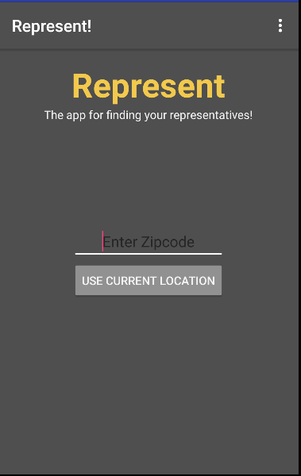

# PROG 02: Represent!

Briefly describe your app here.

## Authors

Hashmi Hamza ([hhashmi@berkeley.edu](mailto:your_email@berkeley.edu))

## Demo Video

See [your demo video title here] (https://www.youtube.com/watch?v=cFzwONbeAbE)

## Screenshots

## Acknowledgments

* Hat tip to anyone who's code was used
* Any other support
* youtube.com/slidenerd
* http://stackoverflow.com/questions/1489852/android-handle-enter-in-an-edittext
* http://stackoverflow.com/questions/2317428/android-i-want-to-shake-it
* http://stackoverflow.com/questions/5333119/android-opening-the-email-application
* http://stackoverflow.com/questions/4233873/how-do-i-get-extra-data-from-intent-on-android
* http://stackoverflow.com/questions/5271448/how-to-detect-shake-event-with-android
* https://www.binpress.com/tutorial/a-guide-to-the-android-wear-message-api/152
* http://stackoverflow.com/questions/26479193/sending-data-from-an-activity-to-wearablelistenerservice
